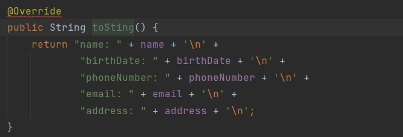
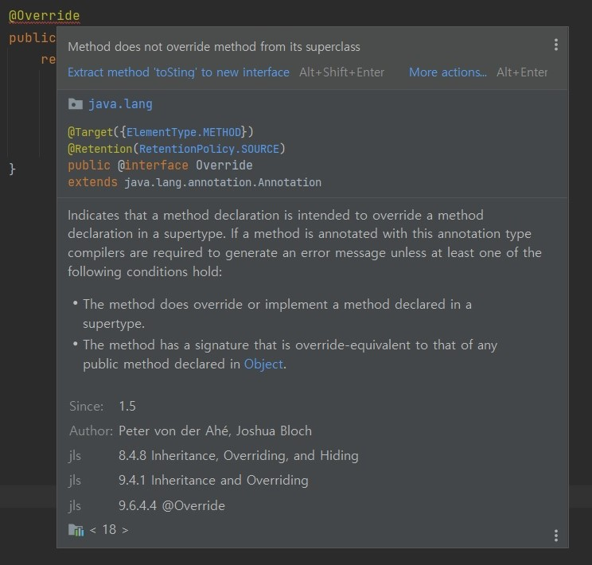
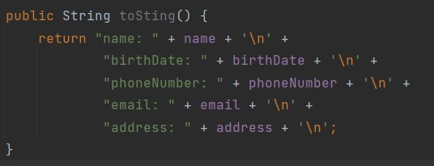

# toString

- toString()이란?

  - `Object 클래스에 정의(재정의, 상속)`
  - toString을 통해서 `객체 안에 있는 데이터의 내용`들을 출력할 수 있다. (재정의시)

- toString을 toSting으로 오타를 내버리면 @Override 어노테이션이 빨간불이 들어온다. 왜일까?
  
  - 어노테이션이 추가적인 부가적인 설명을 해주는 것이다.
  - 이말인 즉슨 오버라이드는 소스레벨에서 유지되는 어노테이션이라는 뜻
  - `@Retention(RestentionPolicy.SOURCE)`
- @Override 어노테이션이 없다면 toString이 오브젝트 클래스에서 왔다는 것을 알 수 있을까?
  
  - 알 수 있다. 모든 클래스들은 Object 클래스의 자식들이기 때문에 없어도 실행이 잘 된다.
- 그렇다면 굳이 @Override 어노테이션을 왜 쓸까?
  
  - `오타방지`를 위해 쓴다
  - 문법적인 추가 성질로 `상위 클래스에서 왔다는 것을 알려주기 위한 용도`이면서 상위 클래스에 없는 메서드를 정의를 하면 어노테이션이 알려준다.(어노테이션을 붙이면 컴파일러가 알려 줌) 
    
  - 만약 실수로 toSting()함수를 정의하고 어노테이션을 붙이지 않으면 클래스에 그냥 toSting()이라는 함수를 정의했나보다라고 알게되는 것이다.
