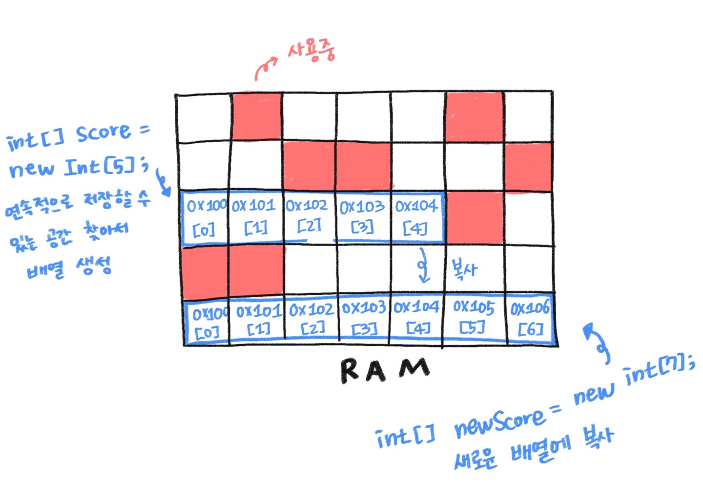
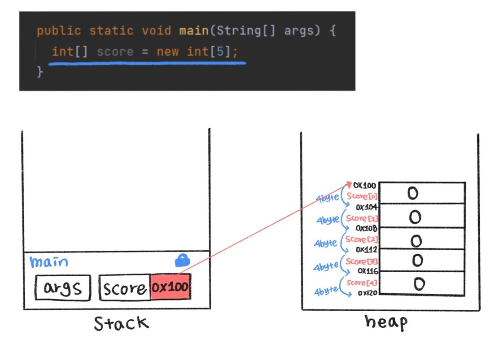

### 배열은 한번 생성하면 실행하는 동안 그 길이를 바꿀 수 없다 왜 일까?

배열은 순차적인 자료구조이기 때문에 연속적으로 저장 할 수 있는 메모리 공간이 필요하다.<br>
RAM 메모리 공간은 비어있는 공간도 있고 사용된 공간도 있다. 그래서 연속적으로 저장할 수 있는 공간을 찾아 배열을 만든다. <br>그런데 공간이 더 필요하여 배열의 크기를 늘렸다. 그러나 처음에 쓴 공간 뒤에 쓸 공간이 비어있다는 보장이 없다. (있을 수도 있고 없을 수도 있다는 것이다.) <br>그래서 처음에 쓴 공간을 확인해서 공간이 부족하면 다른 곳으로 옮겨야 되는데 그렇게 하지 말고 기존 배열의 크기를 아예 늘리지 못하게 하고 새로운 배열을 만들어 기존 배열의 내용을 복사하여 써야한다.


### 배열의 인덱스는 왜 0부터 시작할까?

`array address = 배열의 시작 주소 + 데이터타입의 size * {index} `



배열 참조변수의 주소는 첫 번째 원소의 주소가 배열의 주소가 된다.

배열의 첫번째 원소 주소는 배열의 주소와 동일하기 때문에 배열의 시작주소에서 데이터타입 size에 인덱스를 곱한 값을 더하면 바로 각각의 배열 요소 주소를 계산할 수 있어 인덱스가 0부터 시작하는 것이다.

만약 4byte 공간을 차지하는 int형으로 만든 score 배열의 주소가 100번지였다면 그 다음은 104 그다음은 108.. 연속적, 순차적으로 저장된다. <br>

```
시작 주소	인덱스
100+4∗0	     0
100+4∗1	     1
100+4∗2	     2
100+4∗3	     3
100+4∗4	     4
```

배열은 같은 데이터 타입으로 있어야 배열의 길이를 계산할 수 있다. 다른 데이터 타입이 있으면 각각의 데이터 타입들마다 차지하는 공간이 달라지기 때문에 배열로서 정의하긴 어렵다.

우리가 배열을 정의해야 할 때 알아야하는 것은 배열의 길이와 첫번째에 저장하는 배열의 원소의 주소만 알고 있으면 된다. 


